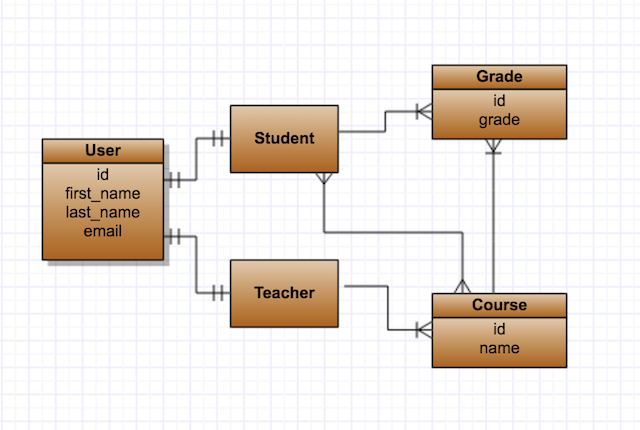

# Highlearn - REST API of the school system for managing course grades built with Ruby on Rails.

## Description
  * The system allows other systems to create and modify Students, Teachers, Courses and Grades using REST API endpoints.
  * The system provides statistical calculations over this data over REST API.
  * The communication with the system is RESTful over HTTP.

## Usage examples (using demo token in example for auth)

#### Get all students
``` bash
# install jq to display it nicely
curl -H 'Accept: application/json' -H "Authorization: 08ede18ff7aa239d0259a989ae765ebc04ca91b8" http://localhost:3000/api/v1/students | jq
```

#### Add new student
``` bash
curl -d '{"first_name":"igor", "last_name":"test", "email":"igor.test@gmail.com"}' -H "Authorization: 08ede18ff7aa239d0259a989ae765ebc04ca91b8" -H "Content-Type: application/json" -X POST http://localhost:3000/api/v1/students
```

#### Update student (need to know record_id to update)
``` bash
curl -d '{"first_name":"igor", "last_name":"zh", "email":"igor.zh@gmail.com"}' -H "Authorization: 08ede18ff7aa239d0259a989ae765ebc04ca91b8" -H "Content-Type: application/json" -X PUT http://localhost:3000/api/v1/students/11
```

#### Delete student
``` bash
curl -H "Authorization: 08ede18ff7aa239d0259a989ae765ebc04ca91b8" -H "Content-Type: application/json" -X DELETE http://localhost:3000/api/v1/students/11
```

## Installing and running using docker and docker-compose
  * git clone https://github.com/warolv/high-learn.git
  * cd high-learn
  * docker-compose build
  * docker-compose up -d
  * docker-compose run web bundle exec rake db:create db:migrate db:seed 
  * check in browser if rails app is running http://localhost:3000 

## Running the tests
  * docker-compose run web bundle exec rake db:migrate RAILS_ENV=test
  * docker-compose run web bundle exec rspec


## Entity Relationship Diagram of high-learn 
 
 

## Implemented API
  Used one level routing to simplify CRUD operation on models (not used nested routes like /course/1/grades)
 
### *Students* REST API endpoints
  * GET    /api/v1/students     Get all students
  * GET    /api/v1/students/1   Get specific student        
  * POST   /api/v1/students     Create student
  * PUT    /api/v1//students/1  Update student
  * DELETE /api/v1//students/1  Delete student
  * GET    /api/v1/students/highest_average_in_courses  The student with the highest average in courses 

### *Teachers* REST API endpoints
  * GET    /api/v1/teachers     Get all teacher              
  * GET    /api/v1/teachers/1   Get specific teacher         
  * POST   /api/v1/teachers     Create teacher
  * PUT    /api/v1//teachers/1  Update Teacher
  * DELETE /api/v1//teachers/1  Delete Teacher
  * GET    /api/v1/teachers/max_students  The teacher with the max number of students.

### *Courses* REST API endpoints
  * GET    /api/v1/courses      Get all courses              
  * GET    /api/v1/courses/1    Get specific course         
  * POST   /api/v1/courses      Create course
  * PUT    /api/v1//courses/1   Update course
  * DELETE /api/v1//courses/1   Delete course
  * GET    /api/v1/courses/easiest      Get the easiest course (the one with the highest average of grades)

### *Grades* REST API endpoints
  * GET    /api/v1/grades       Get all grades              
  * GET    /api/v1/grades/1     Get specific grade         
  * POST   /api/v1/grades       Create grade
  * PUT    /api/v1//grades/1    Update grade
  * DELETE /api/v1//grades/1    Delete grade

### Things to empasize
  * To not duplicate data between teacher and student - I used (STI) Single Table Inheritance, meaning teacher and student models
  both using 'user' table and differntiated by 'type' column
  * Same for API endpoints of teacher / students - both using users controller, using 'type' parameter

### Things that has been left out and need improvement
  * Did minimal test coverage for main functionality - Unit Tests / Request Tests (API)
  * For Calculated fields I am using SQL queries for each request, need improvement - add table with calculates fields for this actions and every time grade/course/teacher/student added/changed/removed update this table via model callbacks, also we may cache this table to get results faster

### Token based authentication 
  * Demo token: "Authorization: 08ede18ff7aa239d0259a989ae765ebc04ca91b8"
  * Testing with curl: curl -H 'Accept: application/json' -H "Authorization: 08ede18ff7aa239d0259a989ae765ebc04ca91b8" http://localhost:3000/api/v1/students

## Built With

  Ruby on Rails 6 - API version, postgres DB

## Authors

* **Igor Zhivilo**

## License

This project is licensed under the MIT License - see the [LICENSE.md](LICENSE.md) file for details
